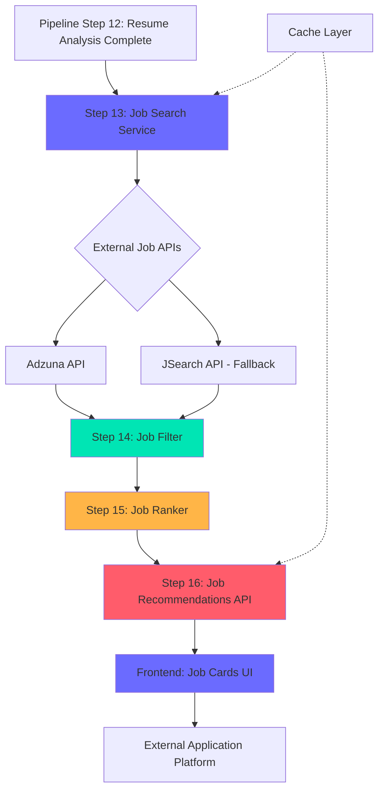

# Technical Design Document: Real-Time Job Search Application

## Overview

This document specifies the technical design for the Real-Time Job Search and Application Module, which extends the Agentic Career Copilot to fetch, filter, rank, and display real-time job listings. The module integrates with external job APIs (Adzuna/JSearch), uses sentence-transformers for semantic ranking, and provides an intuitive UI for job discovery and application.

### Design Goals

- Seamless integration with existing 12-step pipeline (extends to steps 13-16)
- Real-time job search with sub-8-second response time
- Intelligent filtering based on candidate qualifications
- Semantic ranking using ML-based similarity scoring
- Resilient error handling with API fallback mechanisms
- Responsive UI with accessibility compliance

### Key Design Decisions

1. **API Integration Strategy**: Primary/fallback pattern with Adzuna as primary and JSearch as fallback
2. **Ranking Approach**: sentence-transformers (all-MiniLM-L6-v2) for semantic similarity computation
3. **Caching Strategy**: 15-minute TTL cache for API responses to reduce redundant calls
4. **UI Integration**: New section in PipelineDashboard component following existing design patterns
5. **Data Flow**: Resume analysis → Query generation → API search → Filter → Rank → Display

## Architecture

### High-Level Architecture



### System Context

The job search module operates as an extension to the existing pipeline:

- **Trigger**: Automatically invoked after pipeline step 12 (visualization) completes
- **Input**: Resume_Analysis_Data from steps 1-12 (skills, experience, preferences)
- **Output**: Ranked job listings with match scores and application links
- **Integration Points**: 
  - Backend: New service modules and API endpoints
  - Frontend: New section in PipelineDashboard component
  - Database: Extends existing pipeline data storage

### Technology Stack

**Backend:**
- FastAPI (existing framework)
- sentence-transformers (all-MiniLM-L6-v2 model)
- httpx for async API calls
- Redis/in-memory cache for response caching

**Frontend:**
- React (existing framework)
- Existing component library and design system
- Fetch API for backend communication

**External APIs:**
- Adzuna API (primary)
- JSearch API (fallback)

## Components and Interfaces

### Backend Components

#### 1. Job Search Service (`backend/app/services/job_search.py`)

Responsible for querying external job APIs and parsing results.

**Key Functions:**

```python
async def generate_search_query(resume_data: ParsedResume) -> str:
    """
    Generate optimized search query from resume analysis.
    
    Args:
        resume_data: Parsed resume with skills and experience
        
    Returns:
        Formatted search query string
        
    Logic:
        - Extract top 5 most relevant skills
        - Include job titles from experience
        - Exclude generic terms (Microsoft Office, Email, etc.)
        - Format according to API requirements
    """


async def search_jobs_adzuna(
    query: str, 
    location: str = "", 
    max_results: int = 50
) -> list[RawJobListing]:
    """
    Query Adzuna API for job listings.
    
    Args:
        query: Search query string
        location: Geographic location filter
        max_results: Maximum number of results (default 50)
        
    Returns:
        List of raw job listings from API
        
    Raises:
        APIError: If API call fails
        
    Implementation:
        - 5-second timeout per request
        - Parse response into standardized format
        - Extract: title, company, description, skills, experience, type, apply_link
    """

async def search_jobs_jsearch(
    query: str, 
    location: str = "", 
    max_results: int = 50
) -> list[RawJobListing]:
    """
    Query JSearch API for job listings (fallback).
    Similar interface to search_jobs_adzuna.
    """

async def search_jobs_with_fallback(
    query: str, 
    location: str = "", 
    max_results: int = 50
) -> list[RawJobListing]:
    """
    Search with automatic fallback.
    
    Logic:
        1. Try Adzuna API
        2. If fails, try JSearch API
        3. If both fail, return empty list and log error
        4. Check cache before making API calls
        5. Cache successful responses for 15 minutes
    """
```

#### 2. Job Filter Service (`backend/app/services/job_filter.py`)

Filters jobs based on candidate qualifications.

**Key Functions:**

```python
def filter_by_skills(
    jobs: list[JobListing],
    candidate_skills: list[str],
    min_match_ratio: float = 0.6
) -> list[JobListing]:
    """
    Filter jobs by skill match ratio.
    
    Args:
        jobs: List of job listings
        candidate_skills: Skills from resume
        min_match_ratio: Minimum ratio of required skills (default 0.6)
        
    Returns:
        Filtered job listings
        
    Logic:
        - Compare required_skills against candidate_skills
        - Calculate match ratio = matched_skills / required_skills
        - Retain jobs where ratio >= min_match_ratio
        - Track missing_skills for each job
    """


def filter_by_experience(
    jobs: list[JobListing],
    candidate_experience_years: float,
    max_gap_years: float = 2.0
) -> list[JobListing]:
    """
    Filter jobs by experience requirements.
    
    Args:
        jobs: List of job listings
        candidate_experience_years: Years of experience from resume
        max_gap_years: Maximum acceptable gap (default 2.0)
        
    Returns:
        Filtered job listings
        
    Logic:
        - Parse experience_required from job description
        - Exclude jobs where required_experience > candidate_experience + max_gap_years
        - Handle ranges (e.g., "3-5 years") by using minimum value
    """

def filter_by_job_type(
    jobs: list[JobListing],
    preferred_type: str
) -> list[JobListing]:
    """
    Filter jobs by type (internship/full-time).
    
    Args:
        jobs: List of job listings
        preferred_type: "internship", "full-time", or "both"
        
    Returns:
        Filtered job listings
    """

async def apply_all_filters(
    jobs: list[JobListing],
    resume_data: ParsedResume,
    preferences: dict
) -> list[JobListing]:
    """
    Apply all filters in sequence.
    
    Returns:
        Filtered and annotated job listings with missing_skills populated
    """
```

#### 3. Job Ranker Service (`backend/app/services/job_ranker.py`)

Ranks jobs using semantic similarity.

**Key Functions:**

```python
from sentence_transformers import SentenceTransformer, util

class JobRanker:
    def __init__(self):
        self.model = SentenceTransformer('all-MiniLM-L6-v2')
        
    def compute_similarity(
        self,
        job_description: str,
        resume_text: str
    ) -> float:
        """
        Compute semantic similarity between job and resume.
        
        Args:
            job_description: Full job description text
            resume_text: Resume summary and skills text
            
        Returns:
            Similarity score (0.0 to 1.0)
            
        Implementation:
            - Encode both texts using sentence-transformers
            - Compute cosine similarity
            - Return normalized score
        """

        
    async def rank_jobs(
        self,
        jobs: list[JobListing],
        resume_data: ParsedResume
    ) -> list[JobListing]:
        """
        Rank jobs by similarity score.
        
        Args:
            jobs: Filtered job listings
            resume_data: Parsed resume data
            
        Returns:
            Jobs sorted by match_score (descending)
            
        Logic:
            - Build resume text from skills + experience + summary
            - Batch process if > 20 jobs for efficiency
            - Compute similarity for each job
            - Normalize scores to 0-100 range
            - Sort by match_score descending
            - Complete within 3 seconds for up to 50 jobs
        """
```

#### 4. Job Recommendations API (`backend/app/api/routes.py`)

New REST endpoint for job recommendations.

**Endpoint Specification:**

```python
@router.get("/api/jobs/recommendations")
async def get_job_recommendations(
    resume_id: str,
    page: int = 1,
    per_page: int = 10,
    job_type: str = "both",  # "internship", "full-time", "both"
    location: str = ""
) -> JobRecommendationsResponse:
    """
    Get ranked job recommendations for a resume.
    
    Query Parameters:
        - resume_id: Identifier for parsed resume
        - page: Page number for pagination (default 1)
        - per_page: Results per page (default 10, max 50)
        - job_type: Filter by job type
        - location: Geographic location filter
        
    Response:
        {
            "jobs": [
                {
                    "id": "job_123",
                    "title": "Senior ML Engineer",
                    "company": "Anthropic",
                    "location": "San Francisco, CA",
                    "match_score": 91,
                    "required_skills": ["Python", "PyTorch", "FastAPI"],
                    "matched_skills": ["Python", "PyTorch", "FastAPI"],
                    "missing_skills": ["Docker"],
                    "apply_link": "https://...",
                    "job_type": "full-time",
                    "salary_range": "$180K-$240K",
                    "description": "..."
                }
            ],
            "total": 45,
            "page": 1,
            "per_page": 10,
            "has_more": true
        }
        
    Status Codes:
        - 200: Success
        - 404: Resume not found
        - 503: External APIs unavailable
        
    Performance:
        - Complete within 8 seconds (includes search, filter, rank)
        - Use cached results when available
    """
```

### Frontend Components

#### 1. JobRecommendations Component (`frontend/src/components/JobRecommendations.jsx`)

Main container component for job recommendations section.


**Component Structure:**

```jsx
const JobRecommendations = ({ resumeId, onNavigateHome }) => {
  const [jobs, setJobs] = useState([])
  const [loading, setLoading] = useState(false)
  const [error, setError] = useState(null)
  const [filters, setFilters] = useState({
    jobType: 'both',
    location: ''
  })
  const [page, setPage] = useState(1)
  const [hasMore, setHasMore] = useState(false)
  const [appliedJobs, setAppliedJobs] = useState(new Set())
  
  // Fetch jobs on mount and filter changes
  useEffect(() => {
    fetchJobs()
  }, [resumeId, filters, page])
  
  const fetchJobs = async () => {
    // API call to /api/jobs/recommendations
    // Handle loading, error states
    // Update jobs, hasMore
  }
  
  const handleRetry = () => {
    setError(null)
    fetchJobs()
  }
  
  const handleApply = (jobId, applyLink) => {
    window.open(applyLink, '_blank')
    setAppliedJobs(prev => new Set([...prev, jobId]))
    // Track application in localStorage
  }
  
  return (
    <div>
      <JobFilters filters={filters} onChange={setFilters} />
      {loading && <LoadingAnimation />}
      {error && <ErrorMessage error={error} onRetry={handleRetry} />}
      <JobGrid 
        jobs={jobs} 
        appliedJobs={appliedJobs}
        onApply={handleApply}
      />
      {hasMore && <LoadMoreButton onClick={() => setPage(p => p + 1)} />}
    </div>
  )
}
```

#### 2. JobCard Component (`frontend/src/components/JobCard.jsx`)

Individual job listing card.

**Component Structure:**

```jsx
const JobCard = ({ job, isApplied, onApply }) => {
  const isPerfectMatch = job.missing_skills.length === 0
  const matchClass = job.match_score >= 80 ? 'match-high' 
                   : job.match_score >= 60 ? 'match-med' 
                   : 'match-low'
  
  return (
    <div className="job-card" style={{ animation: 'fadeIn 0.4s ease-out' }}>
      <div className="job-card-header">
        <div className="job-company-logo">{getCompanyEmoji(job.company)}</div>
        <div className={`job-match-badge ${matchClass}`}>
          {job.match_score}% match
        </div>
      </div>
      
      <h3 className="job-title">{job.title}</h3>
      <p className="job-company">{job.company} · {job.location}</p>
      
      <div className="job-meta">
        <span>💰 {job.salary_range}</span>
        <span>⏰ {job.job_type}</span>
      </div>
      
      <SkillTags 
        skills={job.required_skills}
        matchedSkills={job.matched_skills}
        missingSkills={job.missing_skills}
      />
      
      {isPerfectMatch && (
        <div className="perfect-match-badge">✨ Perfect Match</div>
      )}
      
      <div className="job-card-actions">
        <button 
          className="job-btn-primary"
          onClick={() => onApply(job.id, job.apply_link)}
          disabled={isApplied}
        >
          {isApplied ? '✓ Applied' : 'Apply Now →'}
        </button>
      </div>
    </div>
  )
}
```


#### 3. SkillTags Component (`frontend/src/components/SkillTags.jsx`)

Displays skill tags with match indicators.

```jsx
const SkillTags = ({ skills, matchedSkills, missingSkills }) => {
  const topMissingSkills = missingSkills.slice(0, 5)
  
  return (
    <div className="job-skill-tags">
      {skills.map(skill => {
        const isMatched = matchedSkills.includes(skill)
        const isMissing = missingSkills.includes(skill)
        
        return (
          <span 
            key={skill}
            className={`job-skill ${isMatched ? 'match' : 'miss'}`}
            title={isMissing ? 'You need to learn this skill' : 'You have this skill'}
          >
            {isMatched ? '✓' : '○'} {skill}
          </span>
        )
      })}
    </div>
  )
}
```

#### 4. JobFilters Component (`frontend/src/components/JobFilters.jsx`)

Filter controls for job type and location.

```jsx
const JobFilters = ({ filters, onChange }) => {
  const jobTypes = [
    { label: 'All Jobs', value: 'both' },
    { label: 'Full-Time', value: 'full-time' },
    { label: 'Internships', value: 'internship' }
  ]
  
  return (
    <div className="job-filters">
      <div className="filter-group">
        <label>Job Type:</label>
        {jobTypes.map(type => (
          <button
            key={type.value}
            className={`filter-btn ${filters.jobType === type.value ? 'active' : ''}`}
            onClick={() => onChange({ ...filters, jobType: type.value })}
          >
            {type.label}
          </button>
        ))}
      </div>
      
      <div className="filter-group">
        <label>Location:</label>
        <input
          type="text"
          placeholder="e.g., San Francisco"
          value={filters.location}
          onChange={(e) => onChange({ ...filters, location: e.target.value })}
        />
      </div>
    </div>
  )
}
```

### Integration with PipelineDashboard

The JobRecommendations component will be added as a new section in PipelineDashboard after step 12:

```jsx
// In PipelineDashboard.jsx
{pipelineData && currentStep === 12 && (
  <ResultCard title="Steps 13-16: Job Recommendations" icon="💼">
    <JobRecommendations 
      resumeId={resumeId}
      onNavigateHome={onNavigateHome}
    />
  </ResultCard>
)}
```

## Data Models

### Backend Schemas

Add to `backend/app/models/schemas.py`:

```python
class RawJobListing(BaseModel):
    """Raw job data from external API"""
    external_id: str
    title: str
    company: str
    location: str
    description: str
    salary_min: Optional[float] = None
    salary_max: Optional[float] = None
    apply_url: str
    job_type: str = "full-time"
    posted_date: Optional[str] = None
    source: str  # "adzuna" or "jsearch"


class JobRecommendation(BaseModel):
    """Processed job recommendation with match data"""
    id: str
    title: str
    company: str
    location: str
    description: str
    salary_range: Optional[str] = None
    required_skills: list[str] = []
    matched_skills: list[str] = []
    missing_skills: list[str] = []
    match_score: float = Field(ge=0, le=100)
    apply_link: str
    job_type: str = "full-time"
    remote: bool = False
    posted_date: Optional[str] = None
    source: str

class JobRecommendationsResponse(BaseModel):
    """API response for job recommendations"""
    jobs: list[JobRecommendation]
    total: int
    page: int
    per_page: int
    has_more: bool
    search_query: str
    filters_applied: dict

class JobSearchPreferences(BaseModel):
    """User preferences for job search"""
    job_type: str = "both"  # "internship", "full-time", "both"
    location: str = ""
    min_salary: Optional[float] = None
    remote_only: bool = False
    
class JobApplicationTracking(BaseModel):
    """Track user applications"""
    job_id: str
    resume_id: str
    applied_at: str
    apply_link: str
    status: str = "applied"  # "applied", "viewed", "saved"
```

### Database Schema

Extend existing database with job recommendations table:

```sql
CREATE TABLE job_recommendations (
    id UUID PRIMARY KEY DEFAULT gen_random_uuid(),
    resume_id VARCHAR(255) NOT NULL,
    job_id VARCHAR(255) NOT NULL,
    title VARCHAR(500) NOT NULL,
    company VARCHAR(255) NOT NULL,
    location VARCHAR(255),
    description TEXT,
    salary_range VARCHAR(100),
    required_skills JSONB,
    matched_skills JSONB,
    missing_skills JSONB,
    match_score FLOAT,
    apply_link TEXT,
    job_type VARCHAR(50),
    remote BOOLEAN DEFAULT FALSE,
    source VARCHAR(50),
    created_at TIMESTAMP DEFAULT NOW(),
    FOREIGN KEY (resume_id) REFERENCES resumes(id)
);

CREATE TABLE job_applications (
    id UUID PRIMARY KEY DEFAULT gen_random_uuid(),
    resume_id VARCHAR(255) NOT NULL,
    job_id VARCHAR(255) NOT NULL,
    applied_at TIMESTAMP DEFAULT NOW(),
    apply_link TEXT,
    status VARCHAR(50) DEFAULT 'applied',
    FOREIGN KEY (resume_id) REFERENCES resumes(id)
);

CREATE INDEX idx_job_recommendations_resume ON job_recommendations(resume_id);
CREATE INDEX idx_job_recommendations_score ON job_recommendations(match_score DESC);
CREATE INDEX idx_job_applications_resume ON job_applications(resume_id);
```

## Implementation Approach

### Phase 1: Backend Services (Steps 13-15)

1. **Job Search Service** (`job_search.py`)
   - Implement query generation from resume data
   - Integrate Adzuna API with authentication
   - Integrate JSearch API as fallback
   - Implement caching layer (Redis or in-memory)
   - Add comprehensive error handling

2. **Job Filter Service** (`job_filter.py`)
   - Implement skill matching algorithm
   - Implement experience filtering
   - Implement job type filtering
   - Add missing skills identification

3. **Job Ranker Service** (`job_ranker.py`)
   - Install sentence-transformers library
   - Load all-MiniLM-L6-v2 model
   - Implement batch processing for efficiency
   - Implement score normalization


### Phase 2: API Endpoint (Step 16)

1. **Job Recommendations Endpoint**
   - Add `/api/jobs/recommendations` route
   - Implement pagination logic
   - Add query parameter validation
   - Integrate with search, filter, and ranker services
   - Add response caching
   - Implement error responses

2. **Database Integration**
   - Create migration scripts for new tables
   - Implement job recommendation storage
   - Implement application tracking storage
   - Add database queries for retrieval

### Phase 3: Frontend Components

1. **JobRecommendations Component**
   - Create main container component
   - Implement API integration
   - Add loading and error states
   - Implement pagination
   - Add localStorage for applied jobs tracking

2. **JobCard Component**
   - Create card layout following existing design system
   - Implement skill tag display
   - Add match score visualization
   - Implement apply button with external navigation

3. **Supporting Components**
   - JobFilters component
   - SkillTags component
   - LoadingAnimation component
   - ErrorMessage component

4. **PipelineDashboard Integration**
   - Add JobRecommendations section after step 12
   - Update step definitions to include steps 13-16
   - Add navigation and state management

### Phase 4: Testing and Optimization

1. **Backend Testing**
   - Unit tests for each service
   - Integration tests for API endpoint
   - Performance testing for ranking algorithm
   - API fallback testing

2. **Frontend Testing**
   - Component unit tests
   - Integration tests for API calls
   - Accessibility testing
   - Responsive design testing

3. **Performance Optimization**
   - Profile ranking algorithm
   - Optimize batch processing
   - Tune cache TTL
   - Implement virtual scrolling for large result sets

### Dependencies

**Backend:**
```txt
sentence-transformers==2.2.2
redis==5.0.0  # Optional, for distributed caching
httpx==0.24.1  # Already in project
```

**Frontend:**
No new dependencies required (uses existing React setup)

### Configuration

Add to `.env`:
```env
# Job Search APIs
ADZUNA_APP_ID=your_app_id
ADZUNA_APP_KEY=your_app_key
JSEARCH_API_KEY=your_api_key

# Caching
REDIS_URL=redis://localhost:6379  # Optional
CACHE_TTL_MINUTES=15

# Job Search Settings
MAX_JOBS_PER_QUERY=50
MIN_SKILL_MATCH_RATIO=0.6
MAX_EXPERIENCE_GAP_YEARS=2.0
```

### Error Handling Strategy

1. **API Failures**
   - Primary API fails → Try fallback API
   - Both APIs fail → Return 503 with error message
   - Timeout after 5 seconds per API call
   - Log all API errors for monitoring

2. **Data Validation**
   - Invalid resume_id → Return 404
   - Invalid query parameters → Return 400 with validation errors
   - Empty results → Return 200 with empty array

3. **Frontend Errors**
   - Network errors → Show retry button
   - Loading timeout → Show error message
   - Invalid data → Show fallback UI

4. **Graceful Degradation**
   - If ranking fails → Return unranked results
   - If filtering fails → Return all results with warning
   - If cache fails → Proceed without caching


## Correctness Properties

*A property is a characteristic or behavior that should hold true across all valid executions of a system—essentially, a formal statement about what the system should do. Properties serve as the bridge between human-readable specifications and machine-verifiable correctness guarantees.*

### Property Reflection

After analyzing all acceptance criteria, I identified the following redundancies and consolidations:

**Redundancies Identified:**
- Properties 2.1, 2.2, 2.3 (individual comparisons) are subsumed by 2.4, 2.5, 2.6 (filtering rules with specific thresholds)
- Property 4.3 (field presence in API response) is redundant with 1.4 (field extraction) - both verify same fields exist
- Properties 5.2, 5.3, 5.4 (individual field display) can be combined into one comprehensive rendering property
- Properties 7.2 and 7.3 (window.open behavior) can be combined into one property
- Properties 9.1 and 9.2 (missing skills identification) are redundant - both verify missing skills are computed and included

**Consolidations Made:**
- Combined skill/experience/type filtering into comprehensive filtering properties
- Combined UI field display requirements into single rendering properties
- Combined missing skills identification into single property
- Removed duplicate field validation properties

The following properties represent the unique, non-redundant correctness requirements:


### Property 1: Query Generation Completeness

*For any* parsed resume with skills and experience data, generating a search query should produce a non-empty string that includes the top 5 most relevant skills and excludes generic terms like "Microsoft Office" or "Email".

**Validates: Requirements 1.1, 8.1, 8.2, 8.3**

### Property 2: API Invocation

*For any* valid search query, the Job_Search_Service should invoke at least one external API (Adzuna or JSearch) with that query.

**Validates: Requirements 1.2**

### Property 3: Job Parsing Completeness

*For any* external API response containing job listings, parsing should produce job objects where each object contains all required fields: title, company, description, required_skills, experience_level, job_type, and apply_link.

**Validates: Requirements 1.3, 1.4**

### Property 4: API Error Handling

*For any* API request that fails or times out, the Job_Search_Service should return an empty result set without throwing an exception.

**Validates: Requirements 1.5**

### Property 5: Skill-Based Filtering

*For any* job listing and candidate skill set, the Job_Filter should retain the job if and only if the candidate possesses at least 60% of the required skills.

**Validates: Requirements 2.4**

### Property 6: Experience-Based Filtering

*For any* job listing with an experience requirement and candidate experience level, the Job_Filter should exclude the job if the required experience exceeds the candidate's experience by more than 2 years.

**Validates: Requirements 2.5**

### Property 7: Job Type Filtering

*For any* job listing and candidate job type preference (when specified), the Job_Filter should exclude jobs that don't match the preferred type.

**Validates: Requirements 2.3, 2.6**

### Property 8: Match Score Bounds

*For any* job that has been ranked, the match_score should be a number in the range [0, 100].

**Validates: Requirements 3.3**

### Property 9: Ranking Order

*For any* list of ranked jobs, the jobs should be sorted in descending order by match_score (highest scores first).

**Validates: Requirements 3.4**

### Property 10: API Response Structure

*For any* valid resume identifier, the /api/jobs/recommendations endpoint should return a JSON object containing a "jobs" array where each job object includes title, company, match_score, apply_link, required_skills, and missing_skills fields.

**Validates: Requirements 4.2, 4.3**

### Property 11: Invalid Resume Handling

*For any* invalid or non-existent resume identifier, the /api/jobs/recommendations endpoint should return HTTP 404 status.

**Validates: Requirements 4.6**

### Property 12: Pagination Correctness

*For any* valid page number and page size parameters, the API should return exactly page_size jobs (or fewer if on the last page), and requesting page N should return a different subset than page N+1.

**Validates: Requirements 4.7**

### Property 13: UI Rendering Completeness

*For any* job recommendation object, the rendered JobCard component should display the job title, company name, match_score, and all required skills with visual indicators distinguishing matched from missing skills.

**Validates: Requirements 5.1, 5.2, 5.3, 5.4**

### Property 14: Filter Application

*For any* job type filter selection (internship, full-time, or both), the displayed jobs should include only those matching the selected type, and the displayed count should equal the number of filtered jobs.

**Validates: Requirements 6.2, 6.3**

### Property 15: Filter Persistence

*For any* filter selection made during a session, remounting the component should restore the same filter state (via localStorage or session state).

**Validates: Requirements 6.4**

### Property 16: Apply Button Behavior

*For any* job card with an apply_link, clicking the "Apply Now" button should invoke window.open with the apply_link and "_blank" target, and should mark that job as applied in the tracking state.

**Validates: Requirements 7.2, 7.3, 7.4**

### Property 17: Applied Job Indication

*For any* job that has been marked as applied, the job card should display a visual indicator (e.g., "✓ Applied" button state) distinguishing it from unapplied jobs.

**Validates: Requirements 7.5**

### Property 18: Missing Skills Identification

*For any* job with required skills and candidate skill set, the missing_skills array should contain exactly those skills that are in required_skills but not in candidate_skills, limited to the top 5 missing skills for display.

**Validates: Requirements 9.1, 9.2, 9.4**

### Property 19: Perfect Match Indication

*For any* job where missing_skills is empty, the job card should display a "Perfect Match" indicator.

**Validates: Requirements 9.5**

### Property 20: API Fallback

*For any* search query where the primary API (Adzuna) fails or times out, the Job_Search_Service should attempt the fallback API (JSearch) before returning results.

**Validates: Requirements 10.1**

### Property 21: Complete API Failure

*For any* search query where both Adzuna and JSearch APIs fail, the service should return HTTP 503 status.

**Validates: Requirements 10.2**

### Property 22: Request Timeout

*For any* external API call, the request should timeout and fail if not completed within 5 seconds.

**Validates: Requirements 10.5**

### Property 23: Response Caching

*For any* successful API response, making the same request within 15 minutes should return cached results without invoking the external API again.

**Validates: Requirements 10.6**

### Property 24: Batch Processing Activation

*For any* job ranking operation with more than 20 jobs, the Job_Ranker should use batch processing for similarity computations.

**Validates: Requirements 11.2**

### Property 25: Result Limiting

*For any* external API request, the Job_Search_Service should request a maximum of 50 results.

**Validates: Requirements 11.5**

### Property 26: Input Format Compatibility

*For any* Resume_Analysis_Data object produced by pipeline step 12, the Job_Search_Service should successfully accept and process it without errors.

**Validates: Requirements 12.1**

### Property 27: Pipeline Event Emission

*For any* complete job search workflow execution, the system should emit exactly four pipeline events: step 13 (search), step 14 (filter), step 15 (rank), and step 16 (API response).

**Validates: Requirements 12.4**

### Property 28: Data Persistence

*For any* job recommendation generated, the system should store it in the job_recommendations table with the correct resume_id foreign key reference.

**Validates: Requirements 12.6**


## Error Handling

### Backend Error Handling

#### API Integration Errors

**Scenario**: External API (Adzuna/JSearch) is unavailable or returns errors

**Handling**:
```python
async def search_jobs_with_fallback(query: str) -> list[JobListing]:
    try:
        # Try primary API (Adzuna)
        results = await search_jobs_adzuna(query)
        return results
    except (httpx.TimeoutException, httpx.HTTPError) as e:
        logger.warning(f"Adzuna API failed: {e}, trying fallback")
        try:
            # Try fallback API (JSearch)
            results = await search_jobs_jsearch(query)
            return results
        except Exception as fallback_error:
            logger.error(f"Both APIs failed: {fallback_error}")
            return []  # Return empty list, don't crash
```

**Response**: 
- Primary fails → Try fallback
- Both fail → Return empty array with 200 status (graceful degradation)
- Log all failures for monitoring

#### Invalid Input Errors

**Scenario**: Invalid resume_id, malformed query parameters

**Handling**:
```python
@router.get("/api/jobs/recommendations")
async def get_job_recommendations(resume_id: str, page: int = 1, per_page: int = 10):
    # Validate resume exists
    if resume_id not in resume_store:
        raise HTTPException(
            status_code=404,
            detail=f"Resume not found: {resume_id}"
        )
    
    # Validate pagination parameters
    if page < 1 or per_page < 1 or per_page > 50:
        raise HTTPException(
            status_code=400,
            detail="Invalid pagination parameters"
        )
```

**Response**: 
- Invalid resume_id → 404 with error message
- Invalid parameters → 400 with validation details

#### Service Failures

**Scenario**: Ranking service fails, filter service fails

**Handling**:
```python
try:
    ranked_jobs = await ranker.rank_jobs(filtered_jobs, resume_data)
except Exception as e:
    logger.error(f"Ranking failed: {e}")
    # Return unranked results with warning
    return {
        "jobs": filtered_jobs,
        "warning": "Ranking unavailable, showing unranked results"
    }
```

**Response**: Graceful degradation with warning messages

#### Timeout Handling

**Scenario**: External API calls exceed timeout threshold

**Handling**:
```python
async with httpx.AsyncClient(timeout=5.0) as client:
    try:
        response = await client.get(api_url, params=params)
    except httpx.TimeoutException:
        logger.warning(f"API timeout after 5 seconds")
        raise APITimeoutError()
```

**Response**: Trigger fallback mechanism or return cached results

### Frontend Error Handling

#### Network Errors

**Scenario**: API request fails due to network issues

**Handling**:
```jsx
const fetchJobs = async () => {
  setLoading(true)
  setError(null)
  
  try {
    const response = await fetch(`${API_BASE}/api/jobs/recommendations?resume_id=${resumeId}`)
    
    if (!response.ok) {
      throw new Error(`HTTP ${response.status}: ${response.statusText}`)
    }
    
    const data = await response.json()
    setJobs(data.jobs)
  } catch (err) {
    setError({
      message: 'Failed to load job recommendations',
      details: err.message,
      retryable: true
    })
  } finally {
    setLoading(false)
  }
}
```

**UI Response**: Display error message with retry button

#### Empty Results

**Scenario**: No jobs match the criteria

**Handling**:
```jsx
{jobs.length === 0 && !loading && !error && (
  <div className="empty-state">
    <p>No jobs found matching your criteria.</p>
    <p>Try adjusting your filters or check back later.</p>
  </div>
)}
```

**UI Response**: Friendly empty state message

#### Loading States

**Scenario**: Data is being fetched

**Handling**:
```jsx
{loading && (
  <div className="loading-container">
    <div className="spinner" role="status" aria-live="polite">
      <span className="sr-only">Loading job recommendations...</span>
    </div>
  </div>
)}
```

**UI Response**: Accessible loading animation with screen reader support

### Error Recovery Strategies

1. **Automatic Retry**: For transient network errors, implement exponential backoff
2. **Cache Fallback**: If API fails, serve stale cached data with warning
3. **Partial Results**: If some jobs fail to process, return successful ones
4. **User Notification**: Clear error messages with actionable next steps
5. **Logging**: Comprehensive error logging for debugging and monitoring

## Testing Strategy

### Dual Testing Approach

This feature requires both unit tests and property-based tests for comprehensive coverage:

- **Unit tests**: Verify specific examples, edge cases, and error conditions
- **Property tests**: Verify universal properties across all inputs using randomized testing

Both approaches are complementary and necessary. Unit tests catch concrete bugs and verify specific scenarios, while property tests verify general correctness across a wide input space.

### Property-Based Testing

**Framework**: Use `hypothesis` for Python backend testing

**Configuration**: Each property test should run a minimum of 100 iterations to ensure comprehensive input coverage.

**Test Tagging**: Each property test must reference its design document property using this format:
```python
# Feature: real-time-job-search-application, Property 1: Query Generation Completeness
```

#### Backend Property Tests

**Test File**: `backend/tests/test_job_search_properties.py`

```python
from hypothesis import given, strategies as st
from hypothesis import settings
import pytest

# Feature: real-time-job-search-application, Property 1: Query Generation Completeness
@given(
    skills=st.lists(st.text(min_size=1, max_size=20), min_size=1, max_size=20),
    experience=st.lists(st.text(min_size=10), min_size=1, max_size=5)
)
@settings(max_examples=100)
def test_query_generation_includes_top_skills(skills, experience):
    """For any resume with skills, query should include top 5 skills and exclude generic terms."""
    resume = create_test_resume(skills=skills, experience=experience)
    query = generate_search_query(resume)
    
    assert len(query) > 0
    assert "Microsoft Office" not in query
    assert "Email" not in query
    
    # Top 5 skills should be in query
    top_5_skills = get_top_skills(skills, n=5)
    for skill in top_5_skills:
        assert skill.lower() in query.lower()


# Feature: real-time-job-search-application, Property 5: Skill-Based Filtering
@given(
    required_skills=st.lists(st.text(min_size=1), min_size=1, max_size=10),
    candidate_skills=st.lists(st.text(min_size=1), min_size=0, max_size=15)
)
@settings(max_examples=100)
def test_skill_filtering_60_percent_threshold(required_skills, candidate_skills):
    """For any job and candidate, filter should retain job iff candidate has >=60% of required skills."""
    job = create_test_job(required_skills=required_skills)
    
    match_ratio = len(set(required_skills) & set(candidate_skills)) / len(required_skills)
    filtered = filter_by_skills([job], candidate_skills, min_match_ratio=0.6)
    
    if match_ratio >= 0.6:
        assert len(filtered) == 1
    else:
        assert len(filtered) == 0

# Feature: real-time-job-search-application, Property 8: Match Score Bounds
@given(
    job_description=st.text(min_size=50, max_size=500),
    resume_text=st.text(min_size=50, max_size=500)
)
@settings(max_examples=100)
def test_match_score_in_valid_range(job_description, resume_text):
    """For any job that has been ranked, match_score should be in [0, 100]."""
    ranker = JobRanker()
    score = ranker.compute_similarity(job_description, resume_text)
    
    assert 0 <= score <= 100
    assert isinstance(score, (int, float))

# Feature: real-time-job-search-application, Property 9: Ranking Order
@given(
    jobs=st.lists(
        st.builds(create_test_job_with_score, 
                  score=st.floats(min_value=0, max_value=100)),
        min_size=2,
        max_size=50
    )
)
@settings(max_examples=100)
def test_jobs_sorted_by_score_descending(jobs):
    """For any list of ranked jobs, they should be sorted by match_score descending."""
    ranker = JobRanker()
    sorted_jobs = ranker.sort_by_score(jobs)
    
    scores = [job.match_score for job in sorted_jobs]
    assert scores == sorted(scores, reverse=True)

# Feature: real-time-job-search-application, Property 18: Missing Skills Identification
@given(
    required_skills=st.lists(st.text(min_size=1), min_size=1, max_size=20),
    candidate_skills=st.lists(st.text(min_size=1), min_size=0, max_size=20)
)
@settings(max_examples=100)
def test_missing_skills_set_difference(required_skills, candidate_skills):
    """For any job and candidate, missing_skills should be required_skills - candidate_skills."""
    job = create_test_job(required_skills=required_skills)
    
    missing = identify_missing_skills(job, candidate_skills)
    expected_missing = set(required_skills) - set(candidate_skills)
    
    assert set(missing) == expected_missing
    assert len(missing) <= 5  # Display limit

# Feature: real-time-job-search-application, Property 20: API Fallback
@given(query=st.text(min_size=1, max_size=100))
@settings(max_examples=100)
async def test_fallback_on_primary_failure(query, mock_adzuna_fail, mock_jsearch_success):
    """For any query where Adzuna fails, should try JSearch."""
    results = await search_jobs_with_fallback(query)
    
    # Verify Adzuna was called first
    assert mock_adzuna_fail.called
    # Verify JSearch was called as fallback
    assert mock_jsearch_success.called
    # Should return JSearch results
    assert len(results) > 0

# Feature: real-time-job-search-application, Property 23: Response Caching
@given(
    query=st.text(min_size=1, max_size=100),
    resume_id=st.text(min_size=1, max_size=50)
)
@settings(max_examples=100)
async def test_cache_hit_within_ttl(query, resume_id, mock_api):
    """For any successful response, same request within 15 min should use cache."""
    # First request
    result1 = await search_jobs_with_fallback(query)
    api_call_count_1 = mock_api.call_count
    
    # Second request within TTL
    result2 = await search_jobs_with_fallback(query)
    api_call_count_2 = mock_api.call_count
    
    # Should not make another API call
    assert api_call_count_2 == api_call_count_1
    assert result1 == result2
```

#### Frontend Property Tests

**Test File**: `frontend/src/components/__tests__/JobRecommendations.test.jsx`

```javascript
import { render, screen, fireEvent } from '@testing-library/react'
import { fc } from 'fast-check'
import JobCard from '../JobCard'
import JobRecommendations from '../JobRecommendations'

// Feature: real-time-job-search-application, Property 13: UI Rendering Completeness
test('JobCard displays all required fields for any job', () => {
  fc.assert(
    fc.property(
      fc.record({
        id: fc.string(),
        title: fc.string({ minLength: 1 }),
        company: fc.string({ minLength: 1 }),
        match_score: fc.integer({ min: 0, max: 100 }),
        required_skills: fc.array(fc.string(), { minLength: 1 }),
        matched_skills: fc.array(fc.string()),
        missing_skills: fc.array(fc.string()),
        apply_link: fc.webUrl()
      }),
      (job) => {
        const { container } = render(<JobCard job={job} />)
        
        // Should display title, company, match_score
        expect(screen.getByText(job.title)).toBeInTheDocument()
        expect(screen.getByText(new RegExp(job.company))).toBeInTheDocument()
        expect(screen.getByText(new RegExp(`${job.match_score}%`))).toBeInTheDocument()
        
        // Should display all skills with indicators
        job.required_skills.forEach(skill => {
          expect(screen.getByText(new RegExp(skill))).toBeInTheDocument()
        })
      }
    ),
    { numRuns: 100 }
  )
})

// Feature: real-time-job-search-application, Property 14: Filter Application
test('Filter displays only matching job types', () => {
  fc.assert(
    fc.property(
      fc.array(
        fc.record({
          id: fc.string(),
          title: fc.string(),
          job_type: fc.constantFrom('full-time', 'internship')
        }),
        { minLength: 5, maxLength: 20 }
      ),
      fc.constantFrom('full-time', 'internship', 'both'),
      (jobs, filterType) => {
        const { container } = render(
          <JobRecommendations initialJobs={jobs} />
        )
        
        // Apply filter
        const filterButton = screen.getByText(filterType === 'both' ? 'All Jobs' : filterType)
        fireEvent.click(filterButton)
        
        // Count displayed jobs
        const displayedJobs = container.querySelectorAll('.job-card')
        
        if (filterType === 'both') {
          expect(displayedJobs.length).toBe(jobs.length)
        } else {
          const expectedCount = jobs.filter(j => j.job_type === filterType).length
          expect(displayedJobs.length).toBe(expectedCount)
        }
      }
    ),
    { numRuns: 100 }
  )
})

// Feature: real-time-job-search-application, Property 16: Apply Button Behavior
test('Apply button opens link and tracks application', () => {
  fc.assert(
    fc.property(
      fc.record({
        id: fc.string(),
        title: fc.string(),
        apply_link: fc.webUrl()
      }),
      (job) => {
        const mockWindowOpen = jest.spyOn(window, 'open').mockImplementation()
        const mockOnApply = jest.fn()
        
        render(<JobCard job={job} onApply={mockOnApply} />)
        
        const applyButton = screen.getByText(/Apply Now/i)
        fireEvent.click(applyButton)
        
        // Should call window.open with correct params
        expect(mockWindowOpen).toHaveBeenCalledWith(job.apply_link, '_blank')
        
        // Should track application
        expect(mockOnApply).toHaveBeenCalledWith(job.id, job.apply_link)
        
        mockWindowOpen.mockRestore()
      }
    ),
    { numRuns: 100 }
  )
})
```

### Unit Testing

Unit tests complement property tests by verifying specific examples, edge cases, and integration points.

#### Backend Unit Tests

**Test File**: `backend/tests/test_job_search.py`

```python
import pytest
from app.services.job_search import generate_search_query, search_jobs_with_fallback
from app.services.job_filter import filter_by_skills, filter_by_experience
from app.services.job_ranker import JobRanker

def test_query_generation_with_sample_resume():
    """Specific example: sample resume generates expected query."""
    resume = get_sample_resume()
    query = generate_search_query(resume)
    
    assert "Python" in query
    assert "Machine Learning" in query
    assert len(query) > 0

def test_empty_results_handling():
    """Edge case: API returns empty results."""
    results = await search_jobs_with_fallback("nonexistent_job_xyz_123")
    
    assert results == []
    assert isinstance(results, list)

def test_skill_filter_edge_case_no_skills():
    """Edge case: Job has no required skills."""
    job = create_test_job(required_skills=[])
    filtered = filter_by_skills([job], ["Python", "Java"], min_match_ratio=0.6)
    
    # Should handle gracefully
    assert len(filtered) >= 0

def test_experience_filter_with_range():
    """Specific example: Experience requirement is a range."""
    job = create_test_job(experience_required="3-5 years")
    filtered = filter_by_experience([job], candidate_experience_years=2.0, max_gap_years=2.0)
    
    # Should use minimum of range (3 years)
    # Candidate has 2 years, gap is 1 year, should pass
    assert len(filtered) == 1

@pytest.mark.asyncio
async def test_api_timeout():
    """Error condition: API times out."""
    with pytest.raises(APITimeoutError):
        await search_jobs_adzuna("test", timeout=0.001)

def test_ranker_with_identical_texts():
    """Edge case: Job description identical to resume."""
    ranker = JobRanker()
    text = "Python developer with 5 years experience"
    score = ranker.compute_similarity(text, text)
    
    # Should be perfect match
    assert score >= 95  # Allow for floating point
```


#### Frontend Unit Tests

**Test File**: `frontend/src/components/__tests__/JobCard.test.jsx`

```javascript
import { render, screen, fireEvent } from '@testing-library/react'
import JobCard from '../JobCard'

test('displays perfect match indicator when no missing skills', () => {
  const job = {
    id: '1',
    title: 'ML Engineer',
    company: 'Anthropic',
    match_score: 95,
    required_skills: ['Python', 'PyTorch'],
    matched_skills: ['Python', 'PyTorch'],
    missing_skills: [],
    apply_link: 'https://example.com'
  }
  
  render(<JobCard job={job} />)
  expect(screen.getByText(/Perfect Match/i)).toBeInTheDocument()
})

test('limits missing skills display to 5', () => {
  const job = {
    id: '1',
    title: 'Full Stack Dev',
    company: 'Vercel',
    match_score: 50,
    required_skills: ['React', 'TypeScript', 'Node', 'Docker', 'K8s', 'AWS', 'GraphQL'],
    matched_skills: ['React'],
    missing_skills: ['TypeScript', 'Node', 'Docker', 'K8s', 'AWS', 'GraphQL'],
    apply_link: 'https://example.com'
  }
  
  const { container } = render(<JobCard job={job} />)
  const missingSkillTags = container.querySelectorAll('.job-skill.miss')
  
  expect(missingSkillTags.length).toBeLessThanOrEqual(5)
})

test('shows applied state after clicking apply', () => {
  const job = {
    id: '1',
    title: 'ML Engineer',
    company: 'Anthropic',
    match_score: 95,
    apply_link: 'https://example.com'
  }
  
  const { rerender } = render(<JobCard job={job} isApplied={false} />)
  expect(screen.getByText(/Apply Now/i)).toBeInTheDocument()
  
  rerender(<JobCard job={job} isApplied={true} />)
  expect(screen.getByText(/Applied/i)).toBeInTheDocument()
})
```

#### Integration Tests

**Test File**: `backend/tests/test_integration.py`

```python
import pytest
from fastapi.testclient import TestClient
from app.main import app

client = TestClient(app)

def test_full_job_recommendations_flow():
    """Integration test: Full flow from resume upload to job recommendations."""
    # Step 1: Upload resume
    with open("test_resume.pdf", "rb") as f:
        response = client.post("/api/resume/upload", files={"file": f})
    assert response.status_code == 200
    resume_id = response.json()["resume_id"]
    
    # Step 2: Get job recommendations
    response = client.get(f"/api/jobs/recommendations?resume_id={resume_id}")
    assert response.status_code == 200
    
    data = response.json()
    assert "jobs" in data
    assert isinstance(data["jobs"], list)
    
    # Verify job structure
    if len(data["jobs"]) > 0:
        job = data["jobs"][0]
        assert "title" in job
        assert "company" in job
        assert "match_score" in job
        assert "missing_skills" in job
        assert 0 <= job["match_score"] <= 100

def test_pagination():
    """Integration test: Pagination works correctly."""
    resume_id = "sample_demo"
    
    # Get page 1
    response1 = client.get(f"/api/jobs/recommendations?resume_id={resume_id}&page=1&per_page=5")
    data1 = response1.json()
    
    # Get page 2
    response2 = client.get(f"/api/jobs/recommendations?resume_id={resume_id}&page=2&per_page=5")
    data2 = response2.json()
    
    # Pages should have different jobs
    if len(data1["jobs"]) > 0 and len(data2["jobs"]) > 0:
        assert data1["jobs"][0]["id"] != data2["jobs"][0]["id"]

def test_invalid_resume_returns_404():
    """Integration test: Invalid resume ID returns 404."""
    response = client.get("/api/jobs/recommendations?resume_id=invalid_xyz_123")
    assert response.status_code == 404
```

### Test Coverage Goals

- **Backend Services**: 90%+ code coverage
- **API Endpoints**: 100% endpoint coverage
- **Frontend Components**: 85%+ component coverage
- **Property Tests**: 100% of identified properties
- **Integration Tests**: All critical user flows

### Performance Testing

**Load Testing**: Use `locust` or `k6` to test:
- API response time under load (target: <8 seconds for 95th percentile)
- Concurrent user handling (target: 100 concurrent users)
- Cache effectiveness (target: 80%+ cache hit rate)

**Ranking Performance**: Benchmark sentence-transformers:
- 20 jobs: <1 second
- 50 jobs: <3 seconds
- Batch processing efficiency

### Accessibility Testing

- **Automated**: Use `axe-core` for automated a11y testing
- **Manual**: Test with screen readers (NVDA, JAWS)
- **Keyboard Navigation**: Verify all interactions work without mouse
- **ARIA Labels**: Verify proper labeling of dynamic content
- **Color Contrast**: Verify WCAG AA compliance

---

## Summary

This design document specifies a comprehensive real-time job search module that:

1. **Extends the existing pipeline** with steps 13-16 for job search, filtering, ranking, and recommendations
2. **Integrates with external APIs** (Adzuna/JSearch) with robust fallback mechanisms
3. **Uses ML-based ranking** via sentence-transformers for semantic similarity
4. **Provides intuitive UI** with job cards, filters, and application tracking
5. **Ensures correctness** through 28 testable properties covering all requirements
6. **Handles errors gracefully** with comprehensive error handling and recovery strategies
7. **Maintains performance** with caching, batch processing, and optimization strategies

The implementation follows existing architectural patterns, integrates seamlessly with the current codebase, and provides a solid foundation for future enhancements.
