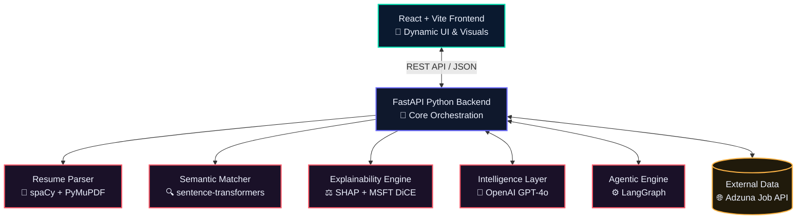

# 🚀 NexusCareer — Explainable AI Career Copilot
**HACKHAZARDS '26 · AI TRACK**

NexusCareer is the first fully explainable, agentic AI career intelligence system. It doesn’t just blindly match resumes to jobs—it tells candidates *exactly why* they qualify, reveals their hidden skill gaps, and autonomously transforms their applications to land the interview. Stop applying blindly. Start getting hired.

---

## 🏆 Key Differentiators
- **Counterfactual Explainability (XAI)**: We use SHAP feature attribution and Microsoft DiCE to explain *every* match score. We don't say "74% match"—we say: "If you add Docker, your score goes from 74% to 91%."
- **Bias Audit Layer**: Ensures EU AI Act compliance by auditing recommendations for demographic bias using Microsoft Fairlearn.
- **Bilateral Matching**: Scores both ways—how good is the candidate for the role, and how good is the role for the candidate's career growth and trajectory.
- **Skill Velocity Tracker**: Live market data mapping which skills are actively rising in demand to prioritize what the candidate learns next.
- **Agentic Autopilot**: A LangGraph-powered multi-step agent for continuous career coaching, realistic mock interview simulation, and autonomous 90-day roadmap generation.
- **Anti-Generic Resume Engine**: Preserves the candidate's authentic voice and real metrics. Eradicates clichéd AI language.

---

## 🏗️ Technical Architecture



---

## 💻 Tech Stack Deep Dive
- **Frontend Layer**: React, Vite, Vanilla CSS (Custom High-End Dark Theme).
- **Backend Infrastructure**: FastAPI, Python 3.11+, Async REST patterns.
- **Explainability (XAI)**: SHAP (SHapley Additive exPlanations), Microsoft DiCE (Diverse Counterfactual Explanations), Microsoft Fairlearn.
- **NLP / Embedding Layer**: `sentence-transformers`, `spaCy`, Cosine Similarity optimizations.
- **Generative AI**: OpenAI `GPT-4o` (or Claude via fallback).
- **Data Integrations**: Adzuna API for live market jobs.

---

## 📁 Project Structure
```text
hack-hazads/
├── frontend/             # React + Vite application
│   ├── src/
│   │   ├── components/   # Interactive demo, charts, XAI UI, chat simulator
│   │   ├── styles/       # Core design system CSS tokens 
│   │   └── utils/        # API integration wrappers
│   └── package.json
└── backend/              # FastAPI Python backend
    ├── app/
    │   ├── api/          # FastAPI Routes (Match, Parse, Chat, Gen)
    │   ├── core/         # Settings and configurations (.env loader)
    │   ├── models/       # Pydantic schemas parsing
    │   └── services/ 
    │       ├── parser.py    # PyMuPDF processing
    │       ├── matcher.py   # Multi-dimensional matching & SHAP scoring
    │       ├── generator.py # LLM orchestration layer
    │       └── jobs.py      # Adzuna API bindings
    ├── main.py
    └── requirements.txt
```

---

## 🚀 Quick Start / Local Development

### 1. Start the Backend API
Requires Python 3.9+.
```bash
cd backend
pip install -r requirements.txt
python main.py
```
*The FastAPI backend will start on `http://localhost:8000` (docs available at `/docs`).*

### 2. Start the Frontend Application
Requires Node.js 18+.
```bash
cd frontend
npm install
npm run dev
```
*The React frontend will start on usually `http://localhost:5173`.*

---

## ⚡ Demo Mode Architecture
We built NexusCareer to be **100% demo-resilient**. If the application is launched without API keys (OpenAI / Adzuna) in the `backend/.env` file, the platform automatically switches to a high-fidelity **Demo Mode**. 

In Demo Mode:
- NLP and XAI calculations use pre-computed realistic edge cases.
- The Interview Simulator utilizes mock response paths to demonstrate the Live Scoring UI.
- Job postings inject localized sample data showcasing matching variations.

---
*Built with ❤️ during HackHazards '26.*
